# Flutter開発環境 - WezTerm + Neovim

WezTermとNeovimを使用した効率的なFlutter開発環境の構築と使用方法について説明します。

## 📋 目次

- [環境構成](#環境構成)
- [セットアップ手順](#セットアップ手順)
- [使用方法](#使用方法)
- [キーバインド一覧](#キーバインド一覧)
- [ワークフロー](#ワークフロー)
- [トラブルシューティング](#トラブルシューティング)

## 🏗️ 環境構成

### 前提条件

- **Flutter SDK**: 3.0以上
- **Dart SDK**: 3.0以上
- **Neovim**: 0.8以上
- **WezTerm**: 最新版
- **Git**: 2.0以上

### 主要コンポーネント

```
Flutter開発環境
├── Neovim + flutter-tools.nvim     # エディタ + Flutter LSP
├── WezTerm                         # ターミナル + ワークスペース管理
├── 自動化スクリプト                  # プロジェクト管理
└── 統合ワークフロー                  # 開発〜デプロイ
```

## 🚀 セットアップ手順

### 1. Flutter開発環境の有効化

```bash
# init.luaでFlutter設定を有効化
cd ~/.config/nvim  # または your-nvim-config-path
nvim init.lua

# 以下の行のコメントアウトを外す
require('flutter-dev')
```

### 2. 新規Flutterプロジェクトの作成

```bash
# セットアップスクリプトを使用
./scripts/flutter-dev-setup.sh my_flutter_app

# 詳細オプション付きで作成
./scripts/flutter-dev-setup.sh my_flutter_app --org com.mycompany --ios --android --web
```

### 3. 既存プロジェクトの設定

```bash
# 既存プロジェクトの最適化
cd existing_flutter_project
/path/to/scripts/flutter-dev-setup.sh existing_flutter_project --existing
```

## 💻 使用方法

### Neovimでの開発

#### 1. プロジェクトを開く

```bash
cd your_flutter_project
nvim .
```

#### 2. Flutter LSPの自動起動

Dartファイルを開くと自動的にflutter-tools.nvimが起動し、以下が利用可能になります：

- **コード補完**: インテリセンス機能
- **エラー検出**: リアルタイム構文チェック
- **ホバー情報**: 関数・クラスの詳細表示
- **定義ジャンプ**: `gd`でコード定義に移動
- **リファクタリング**: `<Leader>rn`で変数リネーム

#### 3. デバッグ機能

```vim
" ブレークポイント設定
<F5>        # デバッグ開始/継続
<F10>       # ステップオーバー
<F11>       # ステップイン
<F12>       # ステップアウト
<Leader>b   # ブレークポイント切り替え
<Leader>du  # デバッグUI表示/非表示
```

### WezTermワークスペース

#### 1. 自動ワークスペース

WezTermがFlutterプロジェクト（pubspec.yamlがある）を検出すると、自動的に以下のレイアウトを作成：

```
┌─────────────────┬──────────────┐
│                 │              │
│   Neovim        │   Flutter    │
│   (メインエディタ)  │   (実行環境)   │
│                 │              │
│                 ├──────────────┤
│                 │              │
│                 │   Logs       │
│                 │   (ログ表示)   │
└─────────────────┴──────────────┘
```

#### 2. 手動ワークスペース作成

```bash
# Cmd+Alt+F でFlutterワークスペースを手動作成
```

### 開発ユーティリティスクリプト

```bash
# プロジェクト管理
./scripts/flutter-utils.sh setup          # 依存関係セットアップ
./scripts/flutter-utils.sh clean          # プロジェクトクリーン
./scripts/flutter-utils.sh doctor         # 環境診断

# 開発・テスト
./scripts/flutter-utils.sh run            # アプリ実行
./scripts/flutter-utils.sh test           # テスト実行
./scripts/flutter-utils.sh analyze        # コード解析

# ビルド・デプロイ
./scripts/flutter-utils.sh build --release  # リリースビルド
./scripts/flutter-utils.sh build --ios      # iOS用ビルド
```

## ⌨️ キーバインド一覧

### Neovim - Flutter専用キーマップ

| キー | 機能 | 説明 |
|------|------|------|
| `<Leader>Fr` | Flutter Run | アプリを実行 |
| `<Leader>Fh` | Hot Reload | ホットリロード |
| `<Leader>FR` | Hot Restart | ホットリスタート |
| `<Leader>Fq` | Quit | Flutterアプリ終了 |
| `<Leader>Fd` | Devices | デバイス一覧表示 |
| `<Leader>Fe` | Emulators | エミュレータ一覧 |
| `<Leader>Ft` | Test | テスト実行 |
| `<Leader>Fc` | Clean | プロジェクトクリーン |
| `<Leader>Fb` | Build APK | APKビルド |

### Neovim - Dart専用キーマップ

| キー | 機能 | 説明 |
|------|------|------|
| `<Leader>Da` | Dart Analyze | コード解析 |
| `<Leader>Df` | Dart Format | コードフォーマット |
| `<Leader>Dp` | Pub Get | 依存関係取得 |
| `<Leader>Du` | Pub Upgrade | 依存関係更新 |

### Neovim - LSPキーマップ

| キー | 機能 | 説明 |
|------|------|------|
| `gd` | Go to Definition | 定義に移動 |
| `K` | Hover | ホバー情報表示 |
| `gr` | References | 参照箇所表示 |
| `<Leader>rn` | Rename | 変数リネーム |
| `<Leader>ca` | Code Action | コードアクション |
| `[d` / `]d` | Diagnostics | 前/次のエラーに移動 |

### WezTerm - Flutter専用ホットキー

| キー | 機能 | 説明 |
|------|------|------|
| `Cmd+Shift+R` | Flutter Run | `flutter run`実行 |
| `Cmd+Shift+H` | Hot Reload | `r`キー送信（ホットリロード） |
| `Cmd+Shift+R` | Hot Restart | `R`キー送信（ホットリスタート） |
| `Cmd+Shift+Q` | Quit App | `q`キー送信（アプリ終了） |
| `Cmd+Alt+F` | Flutter Workspace | Flutter専用レイアウト作成 |

## 🔄 ワークフロー

### 1. 日常開発フロー

```mermaid
graph LR
    A[プロジェクト開始] --> B[WezTerm起動]
    B --> C[自動ワークスペース作成]
    C --> D[Neovim起動]
    D --> E[Flutter LSP起動]
    E --> F[コーディング]
    F --> G[保存時自動フォーマット]
    G --> H[ホットリロード]
    H --> F
```



#### 詳細手順

1. **プロジェクト開始**
   ```bash
   cd your_flutter_project
   wezterm  # 自動的にFlutterワークスペースが起動
   ```

2. **開発作業**
   - 左ペイン: Neovimでコーディング
   - 右上ペイン: `flutter run`でアプリ実行
   - 右下ペイン: ログ監視

3. **ホットリロード**
   - ファイル保存後、`Cmd+Shift+H`でホットリロード
   - 重大な変更時は`Cmd+Shift+R`でホットリスタート

### 2. テスト・ビルドフロー

```bash
# 1. コード品質チェック
./scripts/flutter-utils.sh analyze

# 2. テスト実行
./scripts/flutter-utils.sh test --coverage

# 3. ビルド確認
./scripts/flutter-utils.sh build --release
```

### 3. デバッグフロー

1. **ブレークポイント設定**: `<Leader>b`
2. **デバッグ開始**: `<F5>`
3. **ステップ実行**: `<F10>`, `<F11>`, `<F12>`
4. **変数監視**: デバッグUIで確認

## 🛠️ カスタマイズ

### プロジェクト固有設定

各Flutterプロジェクトに`.nvimrc`を作成してプロジェクト固有の設定を追加：

```lua
-- .nvimrc (プロジェクトルート)
-- プロジェクト固有のキーマップ
vim.keymap.set('n', '<Leader>Fs', ':!flutter run --flavor staging<CR>')
vim.keymap.set('n', '<Leader>Fp', ':!flutter run --flavor production<CR>')

-- プロジェクト固有の設定
vim.opt_local.colorcolumn = "100"  -- 行長制限変更
```

### WezTerm設定のカスタマイズ

プロジェクト固有のWezTerm設定を`.wezterm_workspace.lua`で作成：

```lua
-- .wezterm_workspace.lua
local wezterm = require 'wezterm'

return {
  -- プロジェクト固有のキーバインド
  keys = {
    { key = 's', mods = 'CMD|SHIFT', action = wezterm.action.SendString 'flutter run --flavor staging\r' },
  }
}
```

## 🔧 トラブルシューティング

### よくある問題と解決方法

#### 1. Flutter LSPが起動しない

**症状**: Dartファイルを開いてもLSP機能が利用できない

**解決方法**:
```bash
# Flutter SDKパスの確認
which flutter
echo $PATH

# Neovim設定の確認
nvim --version  # 0.8以上であることを確認

# flutter-tools.nvimの再インストール
rm -rf ~/.local/share/nvim/lazy/flutter-tools.nvim
nvim  # lazy.nvimが自動的に再インストール
```

#### 2. ホットリロードが機能しない

**症状**: `Cmd+Shift+H`を押してもホットリロードされない

**解決方法**:
```bash
# Flutter実行状態を確認
# 右上ペインでflutter runが実行中であることを確認

# Flutter アプリを再起動
# 右上ペインで 'R'（ホットリスタート）を実行

# デバイス接続確認
flutter devices
```

#### 3. WezTermのレイアウトが正しく作成されない

**症状**: 自動ワークスペースが期待通りに動作しない

**解決方法**:
```bash
# pubspec.yamlの存在確認
ls -la pubspec.yaml

# WezTerm設定の再読み込み
# WezTermを再起動

# 手動ワークスペース作成
# Cmd+Alt+F でマニュアル作成
```

#### 4. プラグインのインストールエラー

**症状**: lazy.nvimでプラグインインストールが失敗する

**解決方法**:
```bash
# ネットワーク接続確認
ping github.com

# Git設定確認
git config --global user.name
git config --global user.email

# プラグインキャッシュクリア
rm -rf ~/.local/share/nvim/lazy
nvim  # 再インストール実行
```

#### 5. パフォーマンス問題

**症状**: Neovimの動作が重い

**解決方法**:
```lua
-- flutter-dev.luaで以下を調整
require("flutter-tools").setup {
  debugger = {
    enabled = false,  -- デバッグ機能を無効化
  },
  dev_log = {
    enabled = false,  # ログ機能を無効化
  },
}
```

### 環境診断コマンド

```bash
# 総合診断
./scripts/flutter-utils.sh doctor

# 個別確認
flutter doctor -v
nvim --version
wezterm --version
git --version
```

## 📚 追加リソース

### 公式ドキュメント

- [Flutter公式ドキュメント](https://docs.flutter.dev/)
- [Neovim公式ドキュメント](https://neovim.io/doc/)
- [WezTerm公式ドキュメント](https://wezfurlong.org/wezterm/)

### プラグインドキュメント

- [flutter-tools.nvim](https://github.com/akinsho/flutter-tools.nvim)
- [nvim-lspconfig](https://github.com/neovim/nvim-lspconfig)
- [lazy.nvim](https://github.com/folke/lazy.nvim)

### コミュニティ

- [Flutter開発者フォーラム](https://flutter.dev/community)
- [Neovim Subreddit](https://www.reddit.com/r/neovim/)

---

**🎯 Happy Flutter Development with WezTerm + Neovim!**